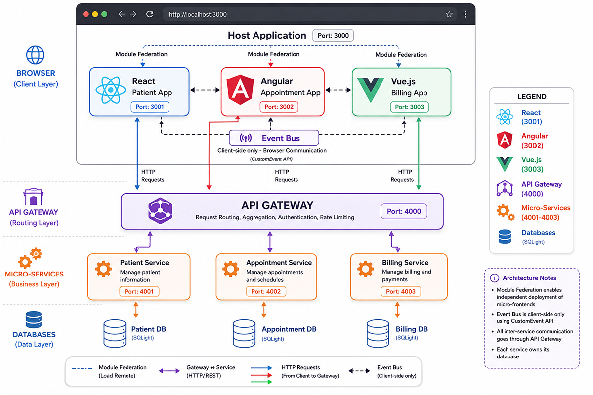

# Healthcare Micro-Frontend Reference Architecture

## A Module Federation demo showcasing React, Angular, and Vue micro-frontends with shared state, API Gateway integration, and independent microservices.

A teaching demo of **micro-frontend + API gateway + micro-service** architecture.
A Module Federation host composes three independently-built React remotes; each
remote talks (through a single API gateway) to its own Express micro-service,
and each service owns its own SQLite database.



| App                           | Port | Type                |
| ----------------------------- | ---- | ------------------- |
| provider-host-mf              | 3000 | MF host (React)     |
| patient-remote-mf             | 3001 | MF remote (React)   |
| appointment-angular-remote-mf | 3002 | MF remote (Angular) |
| billing-Vue-remote-mf         | 3003 | MF remote (Vue)     |
| api-gateway                   | 4000 | gateway             |
| patient-service               | 4001 | service             |
| appointment-service           | 4002 | service             |
| billing-service               | 4003 | service             |

> **Technology-agnostic note:** the appointments tile is served by an **Angular**
> remote (`appointment-angular-remote-mf`), consumed by the **React** host over
> Module Federation. It exposes a framework-neutral `mount()/unmount()` instead
> of a React component, and the host embeds it via a small adapter
> ([MountRemote.tsx](micro-frontends/provider-host-mf/src/components/MountRemote.tsx)).
> The original React appointment remote (3002) is kept temporarily for comparison.

> **Cross-framework event bus:** This demo implements a custom event bus that enables
> real-time state sharing across React, Angular, and Vue micro-frontends. When a patient
> is selected in the React patient app, the Angular appointment and Vue billing apps
> automatically filter their data to show only records for that patient. See the
> [Event Bus Documentation](micro-frontends/EVENT_BUS.md) for details.

## Run everything

From this root folder:

```bash
npm install          # installs the launcher deps (one-time, root only)
npm run install:all  # installs deps in all 8 apps (one-time)
npm run dev          # pick which apps to run, then start them
```

`npm run dev` shows a **checkbox menu with every app pre-selected** — press
Enter to run all, or use ↑/↓ + space to deselect the ones you don't need. The
selected apps run in one terminal, each line prefixed with the app name
(e.g. `gateway`, `patient-mf`).

Press **Ctrl+C once** to stop them — a cleanup step frees the ports of whatever
you launched, so no dev server is left orphaned.

### Stop specific apps

To stop only _some_ apps while the rest keep running, open a **second terminal**
and run:

```bash
npm run stop          # checkbox of RUNNING apps (all pre-selected) — pick what to kill
npm run stop:all      # stop everything, no prompt
node scripts/stop.mjs host appt-svc   # stop specific apps by key
```

`npm run stop` lists only the apps currently running and lets you choose which
to kill; the others keep going in the first terminal.

Then open **http://localhost:3000**.

### Skip the menu

```bash
npm run dev:all         # run everything, no prompt
npm run dev:services    # gateway + the 3 backend services
npm run dev:frontends   # host + the 3 frontend remotes

# or name specific apps:
node scripts/dev.mjs host gateway patient-mf
```

Valid app keys: `gateway`, `patient-svc`, `appt-svc`, `bill-svc`, `host`,
`patient-mf`, `appt-mf`, `bill-mf`, `appt-ng` (the Angular appointment remote).

## Layout

- [`micro-frontends/`](micro-frontends/) — the host and three remotes (React + Rsbuild + Module Federation)
- [`micro-services/`](micro-services/) — the API gateway and three services (Express + better-sqlite3 + TypeScript); see its [README](micro-services/README.md)

## Micro-Frontend Frameworks

This demo showcases **multi-framework micro-frontend architecture** using Module Federation:

| Micro-Frontend  | Framework | Port | Purpose                                            |
| --------------- | --------- | ---- | -------------------------------------------------- |
| **Patient**     | React     | 3001 | Displays patient list, emits selection events      |
| **Appointment** | Angular   | 3004 | Displays appointments, filters by selected patient |
| **Billing**     | Vue.js    | 3003 | Displays invoices, filters by selected patient     |
| **Host**        | React     | 3000 | Composes all remotes using React Router            |

### Cross-Framework Event Bus

The demo implements a **custom event bus** (`micro-frontends/shared-event-bus.ts`) that enables real-time state sharing across different frameworks:

- **Framework-agnostic**: Uses browser's CustomEvent API, works with React, Angular, Vue
- **Decoupled communication**: Micro-frontends communicate without direct dependencies
- **Type-safe**: Event names defined as constants for type safety
- **Automatic cleanup**: Built-in unsubscribe mechanism prevents memory leaks

#### Event Flow

1. User clicks a patient in the **React** patient app
2. Patient app emits `patient:selected` event with patient data
3. **Angular** appointment app receives event and filters appointments
4. **Vue** billing app receives event and filters invoices
5. All apps update their UI to show only data for the selected patient
6. Clearing selection in any app propagates to all other apps

#### Event Names

- `patient:selected` - Emitted when a patient is selected
- `patient:deselected` - Emitted when patient selection is cleared

For detailed implementation guide, see [Event Bus Documentation](micro-frontends/EVENT_BUS.md).

### Framework-Specific Implementation

**React (Patient & Host):**

- Uses React hooks (useState, useEffect) for state management
- Event listeners registered in useEffect with cleanup
- Click handlers emit events via eventBus.emit()

**Angular (Appointment):**

- Uses Angular signals for reactive state management
- Event listeners in ngOnInit with ngOnDestroy cleanup
- Template uses @if and @for control flow syntax

**Vue.js (Billing):**

- Uses Vue 3 Composition API with ref and computed
- Event listeners in onMounted with onUnmounted cleanup
- Template uses v-if and v-for directives
